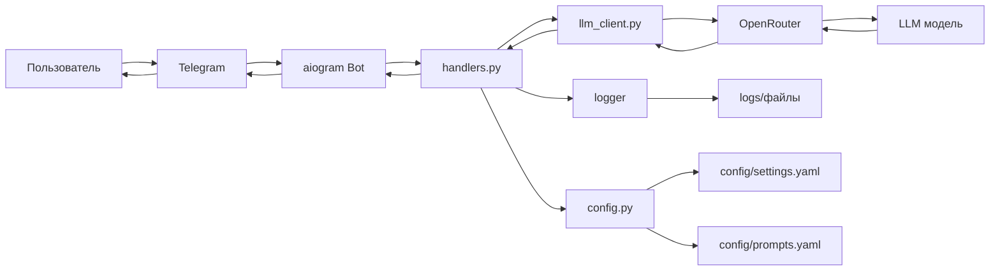

# Техническое видение проекта: LLM-ассистент для первичной консультации

## Содержание

1. [Технологии](#технологии)
2. [Принцип разработки](#принцип-разработки)
3. [Структура проекта](#структура-проекта)
4. [Архитектура проекта](#архитектура-проекта)
5. [Модель данных](#модель-данных)
6. [Работа с LLM](#работа-с-llm)
7. [Мониторинг LLM](#мониторинг-llm)
8. [Сценарии работы](#сценарии-работы)
9. [Деплой](#деплой)
10. [Подход к конфигурированию](#подход-к-конфигурированию)
11. [Подход к логгированию](#подход-к-логгированию)
12. [Makefile для автоматизации](#makefile-для-автоматизации)

---

## Технологии

### Основные технологии
- **Python 3.11+** - основной язык разработки
- **aiogram** - современная библиотека для работы с Telegram Bot API
- **OpenAI client + OpenRouter** - для работы с LLM через единый интерфейс

### Инфраструктура и деплой
- **Docker** - контейнеризация приложения
- **uv** - управление зависимостями и Python окружениями
- **Makefile** - автоматизация команд разработки
- **Локальный ПК** - разработка и тестирование

### Тестирование
- **pytest** - основной фреймворк для тестирования

### Хранение данных
- **Файловая система** - конфигурация и логи в файлах
- **В памяти** - временное состояние сессий

### Что НЕ используем в MVP
- Базы данных (SQLite, PostgreSQL)
- Redis или другие кеши
- Микросервисы (монолитный подход)
- Kubernetes (простой Docker деплой)
- Очереди сообщений (синхронная обработка)

---

## Принцип разработки

### Основной принцип: KISS (Keep It Simple, Stupid)

**Ключевые принципы:**
- **Простота превыше всего** - выбираем самое простое рабочее решение
- **MVP-подход** - сначала минимально работающий продукт, потом улучшения
- **Один сервис** - монолитная архитектура для простоты
- **Явность лучше неявности** - понятный код без магии
- **Fail-fast** - быстрое обнаружение и явные ошибки

**На практике это означает:**
- Линейная структура кода без сложных абстракций
- Минимум зависимостей - только самое необходимое
- Прямолинейная логика без избыточных паттернов
- Настройки в простых файлах
- Логирование в файлы, а не сложные системы

**Чего избегаем:**
- Преждевременной оптимизации
- Сложных паттернов проектирования
- Множественных уровней абстракции
- "Умного" кода, который сложно понять

---

## Структура проекта

### Простая плоская структура

```
llm-consultant/
├── src/
│   ├── bot.py              # Основной файл бота (aiogram)
│   ├── llm_client.py       # Клиент для работы с LLM через OpenRouter
│   ├── handlers.py         # Обработчики сообщений Telegram
│   └── config.py           # Загрузка конфигурации
├── config/
│   ├── settings.yaml       # Основные настройки
│   └── prompts.yaml        # Системные промпты для LLM
├── doc/                    # Документация проекта
│   ├── vision.md           # Техническое видение (этот файл)
│   ├── product_idea.md     # Описание идеи продукта
│   └── README.md           # Документация проекта
├── logs/                   # Логи приложения
├── tests/                  # Тесты
│   └── test_*.py
├── Dockerfile
├── Makefile                # Команды для разработки
├── pyproject.toml          # uv зависимости и настройки
├── .env                    # Переменные окружения (создается из .env.example)
├── .env.example            # Пример переменных окружения
└── README.md               # Основной README
```

### Принципы структуры
- **Плоская структура** - минимум вложенности
- **Один файл = одна ответственность**
- **Конфигурация отдельно от кода**
- **Документация в `doc/`**
- **Логи в отдельной папке**
- **Все в одном репозитории**

---

## Архитектура проекта

### Простая линейная архитектура

**Основные компоненты:**
1. **aiogram бот** - принимает сообщения от пользователей
2. **Обработчики (handlers)** - простые функции для обработки команд/сообщений  
3. **LLM клиент** - отправляет запросы в OpenRouter и получает ответы
4. **Конфигурация** - загружает настройки из YAML файлов
5. **Логирование** - записывает все в файлы

### Поток данных



### Принципы архитектуры
- **Никаких баз данных** - состояние в памяти
- **Никаких очередей** - синхронная обработка
- **Никаких слоев абстракции** - прямые вызовы функций
- **Простые функции** вместо классов где возможно
- **Линейный поток** - от входа до выхода без ветвлений

### Обработка сообщений
1. Пользователь отправляет сообщение в Telegram
2. aiogram получает webhook и парсит сообщение
3. Обработчик определяет тип сообщения (команда/текст)
4. Обработчик формирует prompt и отправляет в LLM
5. Получаем ответ от LLM и отправляем пользователю
6. Логируем весь диалог в файл

---

## Модель данных

### Простые структуры данных в памяти

**1. Сессия пользователя** (dict):
```python
{
    "user_id": 12345,
    "username": "john_doe", 
    "current_state": "consulting",
    "message_history": [...]
}
```

**2. Сообщение** (dict):
```python
{
    "timestamp": "2024-01-15T10:30:00",
    "user_message": "Расскажите о ваших услугах",
    "bot_response": "Мы предлагаем...",
    "llm_model": "gpt-4o-mini"
}
```

**3. Конфигурация** (YAML → dict):
- Настройки бота (токены, URLs)
- Промпты для LLM
- Параметры моделей

### Принципы хранения
- **Сессии** - в памяти (словарь Python)
- **Логи** - в JSON файлах по дням (`logs/2024-01-15.json`)
- **Конфигурация** - в YAML файлах (`config/`)

### Что НЕ используем
- Схемы баз данных
- ORM (SQLAlchemy, etc.)
- Сложные структуры данных
- Сериализация объектов

**Подход:** Простые словари и списки Python + JSON для персистентности логов.

---

## Работа с LLM

### Простой подход без усложнений

**Провайдер и модели:**
- **OpenRouter** через OpenAI client
- **Одна модель** для начала (gpt-4o-mini)
- **Синхронные запросы** без стриминга
- **Прямые вызовы API** без прослоек

**Структура промптов:**
```
Системный промпт + История диалога + Текущее сообщение
```

**Управление промптами:**
- Текстовые шаблоны в `config/prompts.yaml`
- Простая замена переменных `{user_name}`, `{context}`
- Один системный промпт для роли консультанта
- Без версионирования промптов (пока)

**Что НЕ используем:**
- RAG (поиск по документам)
- Fine-tuning
- Кеширование ответов
- Стриминг ответов
- Множественные модели

**Обработка ошибок:**
```python
try:
    response = llm_client.chat(messages)
except Exception:
    return "Извините, произошла ошибка. Попробуйте позже."
```

**Логирование:**
- Все запросы и ответы в лог
- Время выполнения запросов
- Используемая модель

---

## Мониторинг LLM

### Простое логирование и ручной анализ

**Основной подход:**
- **Логирование в файлы** - все запросы, ответы, ошибки
- **Ручной анализ** - смотрим логи при необходимости
- **Никаких дашбордов** - только файлы

**Что отслеживаем:**
```json
{
    "timestamp": "2024-01-15T10:30:00",
    "request_id": "req_123",
    "user_id": 12345,
    "model": "gpt-4o-mini",
    "prompt_tokens": 150,
    "completion_tokens": 80,
    "response_time_ms": 1200,
    "status": "success",
    "error": null
}
```

**Метрики:**
- Время ответа LLM
- Количество токенов (входящих/исходящих)
- Ошибки API
- Успешность запросов

**Структура логов:**
- `logs/llm_requests_2024-01-15.json` - все запросы к LLM
- `logs/errors_2024-01-15.json` - критичные ошибки
- `logs/conversations_2024-01-15.json` - полные диалоги

**Что НЕ используем:**
- Grafana/Prometheus
- Дашборды в реальном времени  
- Алерты в Slack/email
- Сложную аналитику
- A/B тестирование

**Подход:** Записываем все в JSON, анализируем руками когда нужно.

---

## Сценарии работы

### Основные пользовательские сценарии

**1. Сценарий "Первое знакомство":**
```
Пользователь → /start
Бот → Приветствие + краткая информация о компании
Пользователь → Вопрос о услугах
Бот → Описание услуг + уточняющий вопрос
```

**2. Сценарий "Консультация по услугам":**
```
Пользователь → "Нужна помощь с [проблема]"
Бот → Уточняющие вопросы
Пользователь → Детали проблемы
Бот → Рекомендация подходящих услуг
```

**3. Сценарий "Получение контактов":**
```
Пользователь → "Как с вами связаться?"
Бот → Контактная информация + предложение обратного звонка
```

### Простые команды
- `/start` - начало работы
- `/help` - справка
- `/contact` - контакты компании
- Обычный текст - консультация через LLM

### Обработка ошибок
- Непонятный ввод → переспрос
- Ошибка LLM → "Попробуйте позже"
- Долгий ответ → "Обрабатываю..."

**Принцип:** Один линейный поток без сложных состояний и ветвлений.

---

## Деплой

### Простой локальный запуск через Docker

**Целевая среда:**
- **Локальный ПК** - разработка и тестирование
- **Docker Desktop** - контейнеризация
- **Ручной запуск** - без автоматизации

**Процесс запуска через Makefile:**
```bash
# Сборка образа
make build

# Запуск контейнера
make run

# Остановка
make stop

# Просмотр логов
make logs
```

**Или напрямую через Docker:**
```bash
# Сборка образа
docker build -t llm-consultant .

# Запуск контейнера
docker run -d \
  --name llm-consultant \
  --env-file .env \
  -v ./logs:/app/logs \
  -v ./config:/app/config \
  llm-consultant
```

**Структура Docker:**
```dockerfile
FROM python:3.11-slim
WORKDIR /app

# Установка uv
RUN pip install uv

# Копирование файлов зависимостей
COPY pyproject.toml .

# Установка зависимостей
RUN uv pip install --system -r pyproject.toml

# Копирование исходного кода
COPY src/ ./src/

# Создание папки для логов
RUN mkdir -p logs

# Запуск приложения
CMD ["python", "src/bot.py"]
```

**Управление через Makefile:**
- `make logs` - просмотр логов
- `make stop` - остановка
- `make restart` - перезапуск
- `make clean` - очистка контейнеров
- `make test` - запуск тестов

**Или напрямую через Docker:**
- `docker logs llm-consultant` - просмотр логов
- `docker stop llm-consultant` - остановка
- `docker restart llm-consultant` - перезапуск

**Что НЕ используем:**
- Kubernetes
- CI/CD пайплайны  
- Деплой на сервер
- Load balancers
- Автоскалирование
- Docker Compose (пока одного контейнера достаточно)

**Подход:** Максимально простой локальный запуск для разработки и тестирования.

---

## Подход к конфигурированию

### Простые файлы без усложнений

**Структура конфигурации:**
- `config/settings.yaml` - основные настройки бота и LLM
- `config/prompts.yaml` - системные промпты
- `.env` - секретные ключи и токены (создается из `.env.example`)

**Пример settings.yaml:**
```yaml
bot:
  name: "LLM Consultant"
  description: "Консультант по услугам компании"
  
llm:
  model: "openai/gpt-4o-mini"
  max_tokens: 1000
  temperature: 0.7
  
logging:
  level: "INFO"
  format: "json"
```

**Пример prompts.yaml:**
```yaml
system_prompt: |
  Ты - консультант компании по оказанию услуг.
  Твоя задача - выявить потребности клиента и предложить подходящие услуги.
  
welcome_message: |
  Добро пожаловать! Я помогу вам найти подходящие услуги нашей компании.
```

**Пример .env:**
```bash
TELEGRAM_BOT_TOKEN=your_bot_token_here
OPENROUTER_API_KEY=your_openrouter_key_here
```

**Принципы:**
- **Простые файлы** - без схем и валидации
- **Ручное редактирование** - изменения через текстовый редактор
- **Без hot-reload** - перезапуск для применения изменений
- **Явные настройки** - никаких значений по умолчанию в коде

**Загрузка конфигурации:**
```python
import yaml
import os

def load_config():
    with open('config/settings.yaml') as f:
        return yaml.safe_load(f)
```

---

## Подход к логгированию

### Простые файлы и ручной анализ

**Структура логов:**
- `logs/app_2024-01-15.log` - общие логи приложения (текст)
- `logs/conversations_2024-01-15.json` - все диалоги пользователей
- `logs/llm_requests_2024-01-15.json` - запросы к LLM с метриками

**Пример лога диалога:**
```json
{
    "timestamp": "2024-01-15T10:30:15",
    "user_id": 12345,
    "username": "john_doe",
    "user_message": "Расскажите о ваших услугах",
    "bot_response": "Мы предлагаем следующие услуги...",
    "response_time_ms": 1200
}
```

**Пример лога LLM запроса:**
```json
{
    "timestamp": "2024-01-15T10:30:14", 
    "request_id": "req_123",
    "user_id": 12345,
    "model": "openai/gpt-4o-mini",
    "prompt_tokens": 150,
    "completion_tokens": 80,
    "total_tokens": 230,
    "response_time_ms": 1180,
    "status": "success",
    "error": null
}
```

**Принципы логирования:**
- **JSON формат** для структурированных данных
- **Ротация по дням** - новый файл каждый день
- **Стандартный Python logging** - никаких сложных библиотек
- **Все важные события** - старт/стоп, ошибки, диалоги

**Настройка логирования:**
```python
import logging
import json
from datetime import datetime

def setup_logging():
    logging.basicConfig(
        level=logging.INFO,
        format='%(asctime)s - %(levelname)s - %(message)s',
        handlers=[
            logging.FileHandler(f'logs/app_{datetime.now().strftime("%Y-%m-%d")}.log'),
            logging.StreamHandler()
        ]
    )
```

**Что НЕ используем:**
- ELK Stack (Elasticsearch, Logstash, Kibana)
- Grafana для логов
- Centralized logging
- Log aggregation
- Structured logging libraries

**Подход:** Простые файлы + ручной анализ при необходимости.

---

## Makefile для автоматизации

### Простые команды для разработки

**Структура Makefile:**
```makefile
.PHONY: help build run stop restart logs clean test setup

help:
	@echo "Доступные команды:"
	@echo "  setup    - Первоначальная настройка проекта"
	@echo "  build    - Сборка Docker образа"
	@echo "  run      - Запуск контейнера"
	@echo "  stop     - Остановка контейнера"
	@echo "  restart  - Перезапуск контейнера"
	@echo "  logs     - Просмотр логов"
	@echo "  test     - Запуск тестов"
	@echo "  clean    - Очистка контейнеров и образов"

setup:
	@echo "Настройка проекта..."
	@mkdir -p logs config
	@cp .env.example .env || echo "Создайте файл .env по примеру .env.example"
	@echo "Установите значения в .env файле"

build:
	docker build -t llm-consultant .

run:
	docker run -d \
		--name llm-consultant \
		--env-file .env \
		-v ./logs:/app/logs \
		-v ./config:/app/config \
		llm-consultant

stop:
	docker stop llm-consultant || true
	docker rm llm-consultant || true

restart: stop build run

logs:
	docker logs -f llm-consultant

test:
	docker run --rm \
		--env-file .env \
		-v ./tests:/app/tests \
		llm-consultant \
		python -m pytest tests/

clean:
	docker stop llm-consultant || true
	docker rm llm-consultant || true
	docker rmi llm-consultant || true
	docker system prune -f
```

**Основные команды:**
- `make setup` - первоначальная настройка проекта
- `make build` - сборка Docker образа
- `make run` - запуск контейнера
- `make logs` - просмотр логов в реальном времени
- `make stop` - остановка и удаление контейнера
- `make restart` - полный перезапуск (stop + build + run)
- `make test` - запуск тестов в контейнере
- `make clean` - полная очистка (контейнеры + образы)

**Принципы:**
- **Простые команды** - одно действие = одна команда
- **Автоматизация рутины** - сборка, запуск, тестирование
- **Совместимость с KISS** - никаких сложных скриптов
- **Документированность** - `make help` показывает все команды

---

## Заключение

Данное техническое видение описывает максимально простой подход к созданию LLM-ассистента для первичной консультации клиентов. Все решения направлены на быструю разработку MVP с возможностью последующего улучшения.

**Ключевые принципы:**
- **KISS (Keep It Simple, Stupid)** - простота во всем
- **Монолитная архитектура** - один сервис
- **Файловое хранение данных** - без баз данных
- **Простые технологии** - Python, Docker, YAML
- **Автоматизация через Makefile** - простые команды
- **Локальная разработка** - запуск на ПК

**Быстрый старт:**
1. `make setup` - настройка проекта
2. Заполнить `.env` файл токенами
3. `make build` - сборка образа
4. `make run` - запуск бота
5. `make logs` - просмотр работы

Данный документ служит основой для начала разработки проекта.
